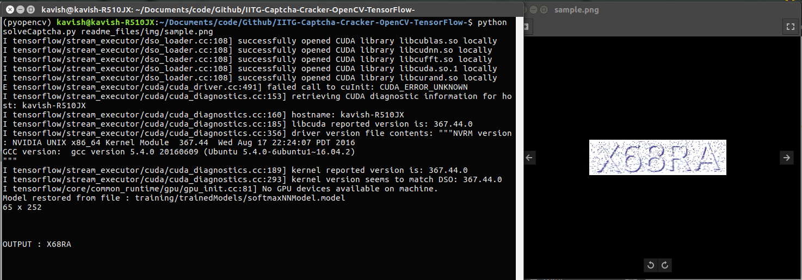
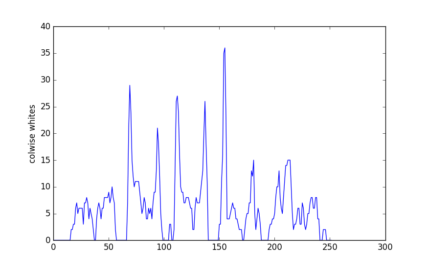

# IITG-Captcha-Solver-OpenCV-TensorFlow
Cracking IITG's webmail captcha using a simple Feed Forward Neural Network

##Script in action

##Dependencies

 1. Python 3.5
 2. OpenCV 3
 3. Tensorflow (preferably with Cuda Toolkit 7.5 and cuDNN v5)

You can completely recreate my conda environment using the environment config file conda_env_pyopencv.yml

You can recreate the environment like this : `conda env create -f conda_env_pyopencv.yml`

##Introduction
This project tries to train a supervised model that can crack IIT Guwahati's webmail captcha system.
Below is a sample captcha image:

Preliminary result using a basic FFNN (Softmax Regression + Cross Entropy) with 12000 training inputs and 3000 testing inputs gives an **accuracy of about 95%**. Similar NNets with one or more hidden layers could perform significantly better.

## Tools Used
The project was implemented entirely in python.

 1. OpenCV : For Image processing requirements
 2. TensorFlow : For implementing the Neural Network

## Details

### Processing input captcha image
As can be seen from the sample, the captcha tries to obfuscate its contents by adding a lot of random "salt and pepper" style noise to the rendered characters. The characters are further obfuscated by incomplete rendering. Only a shadow of of the character (with the imaginary light source at the top left of the image) is rendered onto the captcha thus making it slightly difficult to clearly isolate individual characters.

#### Removing noise from image
First course of action was to clear the noise from the image in order to make segmentation of the image into characters much easier. The image was first converted to grayscale and a threshold applied so that the resultant image only has black or white pixels. Some internet research and test runs showed that **medianBlur** did a good job of getting rid of the random pixels in the image.

Following is a sample output of image after thresholding.

Following is a sample output of image after applying medianBlur.

To make the final result even more clean, a round of erode and dilate was applied.
Following is the result of applying a single iteration of erode followed by dilate using a 2x2 kernel.

#### Segmentation : Extracting individual characters
Luckily, the captcha always has exactly 5 characters (alphabets always capital) which helps us make some initial assumptions about the segmentation. As an initial test, I counted the number of white pixels in the image per column and plotted the same on a graph where X axis denotes the column in the image and X axis denotes the number of white pixels in that column.
Below is the graph mentioned above for sample image:

It was clear upon visible inspection that a simple clustering algorithm should be able to effectively group the characters into individual clusters. I transformed the output of the previous medianBlur operation into a binary matrix of the same size as that of the image where 0 denotes a black pixel and 1 denotes a white pixel. Then I applied k-means with K=5 for all (i,j) pairs of the matrix where the value was 1 (i.e white pixels). The results were positive with almost all characters always being segmented into individual clusters.

Below is a color coded result of the clusters identified by k-means. White vertical bar drawn at x co-ordinate of center of the respective cluster.

Once the character's pixels were identified, a bounding box of 65x45 pixels was defined around the center of its cluster and the character was extracted form the captcha. These 65x45 sized images formed the basis of the training and testing of the model.

### Data Collection
It was imperative that a large amount of training data will be required for properly training the model (supervised) and hence I setup a php page that displays random captchas and allows the user to enter its result in a text box. The image and the results were then stored in a systematic form.

Below is a screenshot of the data-collection php page.

Following are the statistics of the total data collected in over two days:

| .. | ..  |
|--------------------------|-------|
| Total Captchas Collected | 3016  |
| Total Charactes Collected (5 per captcha)| 15080 |

_
Following are character wise statistics of data collected.

| .. | ..  | ..  | ..  |
|--------------------------|-------|---|---|
|	2	|	559	|	g	|	578	|
|	3	|	575	|	h	|	526	|
|	4	|	517	|	k	|	536	|
|	5	|	553	|	m	|	539	|
|	6	|	535	|	n	|	538	|
|	7	|	512	|	p	|	559	|
|	8	|	489	|	r	|	520	|
|	9	|	548	|	s	|	553	|
|	a	|	570	|	t	|	535	|
|	b	|	534	|	v	|	526	|
|	c	|	515	|	w	|	517	|
|	d	|	536	|	x	|	555	|
|	e	|	504	|	y	|	565	|
|	f	|	527	|	z	|	559	|

### Defining the Neural Network
As a preliminary effort, I designed a simple FFNNet without any hidden layers. These steps were followed from the MNIST sample of the tensorFlow documentation.

Each input image was to be input entirely in the neural net. Hence the total neurons required in the input layer were `64*45 = 2925`.
Upon observation of the collected data, it was found that not all characters and numbers from the English alphabet were being used in the captchas. In all only 28 different characters and numbers appeared in the captcha. Hence the output layer of the NNet was created with 28 neurons.
Weights were to be learned for each pixel and each output class, hence a weight matrix of size `2925x28` was required along with a bias matrix of `28x1`.
The output **y** would be a `28x1` matrix where each row is mapped to one of the 28 expected characters in the captcha. The y vector would ideally contain 1 for the correct output character and 0 for all others. For actual outputs, we pass them through a softmax layer to convert the output into a probability distribution and the choose the most probable output.

Overall the forward step would look something like this:

`y = Wx + b`

Error function was defined using the cross-entropy measure.

Gradient Descent with a learning rate of 0.5 was used for back-propogation.

### Training the Neural Net
From the 15000 collected individual characters, 12000 random characters were used for training the NNet.
Each character image was converted into a `2925x1` vector and its expected output into a `28x1` vector. Tensor flow automates the back-propogation step hence the only effort required was of selecting random batches of 100 from the 12000 inputs and repeating the training step for 1000 iterations.
The result was a trained Weight and Bias matrix which tensorFlow allowed to be stored to a file for later recovery.
**Note:** I also installed the CUDA libraries which worked well with tensorFlow significantly reducing the training time. My graphics card is a NVidia GTX-950m.

### Results : Testing the Neural Net
The remaining 3000 characters from the collected data were used for testing the trained model. The accuracy was observed to be about 95%, quite good for a basic model, but can be certainly improved further.

### Sample Output for Webmail Captcha
Below is a screenshot of the result of the model when given a sample webmail captcha. The results are accurate mode of the times.

### Shortcomings
The model tends to fail in recognizing the difference between 2's and z's. Although the number of 2's and z's collected during data collection were equal, it could be the case that the random samples chosen for training the NNet had more z's than 2's thus causing the biased output.
Creating a deeper NNet does seem to promise higher accuracy. However I have no intuitive of mathematical explanation for it. Adding a hidden layer to improve accuracy will be the future goal of this project. Any contributions/PRs are welcome as long as they are first discussed with me in detail.
